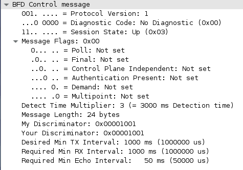
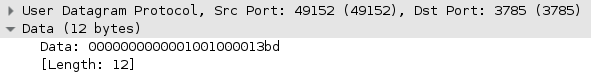
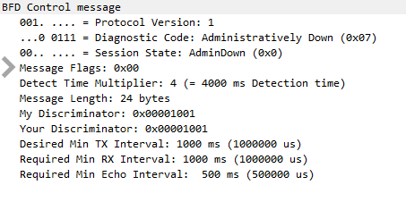

Bidirectional Forwarding Detection (RFC 5880) är ett protokoll som är
framtaget för att snabbt kunna upptäcka problem med paketförmedling
mellan två grannar. Det är från början utvecklat av Cisco och Juniper.
Det är helt oberoende av vilken topologi, media eller routing-protokoll
som används. Olika typer av kontrollplansprotokoll kan utnyttja
BFD-protokollets feldetektering. Genom snabb feldetektering kan olika
kontrollplansprotokoll agera på ett problem snabbare. BFD är en viktig
komponent för att sänka konvergenstider (recovery) inom ett nätverk. Det
har en gemensam interface-down-event-detection-mekanism som andra
protokoll kan utnyttja för sin feldetektering, exempel på detta är
routingprotokollen (även [IS-IS](/Cisco_IS-IS "wikilink") som inte är
IP-baserat), [PIM](/Cisco_PIM "wikilink"), HSRP och MPLS
[pseudowires](/Cisco_VPLS "wikilink"). Samtidigt som det är mindre
CPU-krävande än andra tekniker för feldetektering, t.ex. det
traditionella att skicka och behandla Hello-paket.

Beroende på IOS-version finns det stöd för BFD forwarding på
point-to-point IPv4, IPv6 och [GRE](/Cisco_GRE "wikilink")-tunnlar. Det
är ej supporterat på [VTI](/Cisco_IPsec#VTI "wikilink") och det bör ej
köras på virtual-template eller dialer interfaces. BFD-paket matchar ej
på [QoS](/Cisco_QoS "wikilink")-policy för self-generated packets. BFD
är alltid unicast och [CEF](/Cisco_CEF "wikilink") är ett krav på de
inblandade enheterna.

### Paket

/// caption
Control packet
///

/// caption
Echo packet
///

Konfiguration
=============

BFD finns i version 0 och 1. Den största skillnaden är att version 1
stödjer echo mode, se nedan. Cisco IOS kör version 1 default och kan
inte konfigureras att köra version 0, men är bakåtkompatibel med det
ifall det kommer in v0-paket från någon annan. BFD kan köras i
asynchronous mode eller demand mode men IOS sätter alltid Demand bit
till 0.

**Aktivera**
Ange tröskelvärden per interface, detta måste göras innan BFD kan
användas eftersom det inte finns några default (OBS ip unnumbered
interfaces stöds ej). Dessa värden jämförs med andra sidan och de
behöver inte matcha utan de högsta värdena är de som används. (Den
första 50 är min_tx)

`interface gi2`
` bfd interval 50 min_rx 50 multiplier 3`

Sedan måste man registrera det protokoll som ska dra nytta av BFD. Detta
görs per protokoll, se t.ex. BFD-konfiguration för
[HSRP](/Cisco_HSRP#BFD "wikilink"), [OSPF](/Cisco_OSPF#BFD "wikilink")
och [BGP](/Cisco_BGP#BFD "wikilink"). Det är på så sätt BFD får reda på
vad andra sidan har för adress så ett grannskap är möjligt. Efter att
detta är gjort drar BFD igång och upprättar grannskap. Om andra sidan
inte har slagit på BFD kommer varje BFD Control message besvaras med en
ICMP (Type 3) Destination Unreachable och grannskapet förblir Down.

Verifiera genom att kolla grannskap och vilka protokoll som utnyttjar
BFD.

`show bfd neighbors`
`show bfd neighbors details | i Registered`
`show bfd summary client`

**Felsök**

`show monitor event cef bfd all`
`show bfd drops`
`debug bfd event`
`debug bfd packet`

IPv6, vissa plattformar har problem med att BFD-sessioner över IPv6 går
ner med jämna mellanrum. En workaround för detta är att sätta automatisk
refresh av ND-cachen.

`interface gi2`
` ipv6 nd cache expire 120 refresh`

**Avaktivera**
Man kan även avaktivera BFD per interface utan att ta bort
konfigurationen, då skickas fem Control messages med code Admin Down
till andra sidan.

`interface gi2`
` ip ospf bfd disable`

/// caption
Admin Down
///

### Echo mode

Om andra sidan är långsam på att svara pga överlastad CPU sätter BFD
interfacet som down fast det inte är det. Vill man slippa detta kan man
höja timers men då försvinner meningen med BFD. För att lösa det kan man
använda Echo mode, då kommer inte BFD-paketen att gå till andra sidans
CPU utan vända direkt på interfacet (i ASIC:en). Detta är default på
Cisco-enheter. Eftersom echo-paket som inte påverkar CPUn används för
feldetektering behövs inte BFD-kontrollpaketen skickas lika ofta. Detta
går att ställa manuellt med slow-timers och påverkar inte hur ofta echos
skickas. BFD control packets är UDP från 49152 till 3784 som kan skickas
multihop. Echo packets är UDP till 3785 och fungerar endast single hop.

`bfd slow-timers `<msec>
`show bfd neighbors details`

Stäng av echo mode på ett interface, inga BFD-echos skickas eller
forwardas. ip redirects behövdes stängas av förr för echo mode men det
är inte ett krav längre. Om man kör Unicast Reverse Path Forwarding på
ett interface måste man stänga av echo mode eftersom echo packets
rejectas av uRPF och grannskapet kommer att flappa kontinuerligt.

`no bfd echo`

BFD kan köras i både mjukvara och hårdvara.

`show bfd neighbors details | i Session Host`
`show bfd neighbors hardware`

### Template

Man kan skapa en template som man sedan använder på alla interface. Då
kan man använda authentication och dampening samt få stöd för
microsekunder.

`bfd-template single-hop BACKBONE`
` interval microseconds min-tx 50000 min-rx 50000 multiplier 3`
` authentication sha-1 keychain BFD`
` dampening 10 1000 1000 10`

`interface Gi2`
` bfd template BACKBONE`

Verify

`show bfd neighbors dampening `
`show bfd neighbors dampened`

### Static routes

BFD går faktiskt att använda med static routes, man måste bara berätta
vilken next-hop som ska monitoreras. I associated mode associeras den
statiska routen med den statiska BFD-grannen om routens next-hop matchar
den. I unassociated mode kommer alltid grannen att requesta en
BFD-session om interfacet har BFD-konfiguration, detta är användbart om
det inte finns någon static route än.

`ip route static bfd gi2 1.1.1.1 [unassociate]`
`ip route 10.0.0.0 255.255.255.0 gi2 1.1.1.1`

`show ip static route`

### EBGP Multihop

`bfd-template multi-hop MH`
` interval both 250 multiplier 3`

`bfd map ipv4 2.2.2.2/32 1.1.1.1/32 MH`

`router bgp 1`
` neighbor 2.2.2.2 fall-over bfd multi-hop `

**strict-mode** - Grannskapet går inte upp om inte BFD lyckas, dvs hold
down neighbor session tills BFD session är uppe.

### NX-OS

Det mesta av ovan gäller [Nexus](/Cisco_Nexus "wikilink")-switchar också
(med eventuell syntaxskillnad) men det finns funktioner som är unika.
BFD timers kan konfas globalt och det finns default-värden, 50ms x 3. På
vissa linjekort kan man ställa intervall ner till 15ms.

`feature bfd`

`bfd interval 50 min_rx 50 multiplier 3 `

`router ospf 1`
` bfd`

ICMP/ICMPv6 redirects bör stängas av på de interface (även SVI:er) där
man kör BFD.

`interface e1/1`
` no ip redirects `
` no ipv6 redirects `

**Subinterface**
BFD upprättar ju sessioner på alla subinterface som är konfade med BFD
men man kan optimera det. Det subinterface med lägst vlan id blir master
och kommer att använda huvudinterfacets inställningar medans övriga
subinterface kör med slow timers. Om master får BFD timeout så markeras
alla subinterface som down av BFD. Detta funkar endast mellan Cisco
NX-OS devices och konfas på huvudinterfacet.

`interface ethernet 2/1`
` bfd optimize subinterface`

**Port Channel**
Detta är ingen Nexus-specifik feature men på en L3 port channel kan
NX-OS låta BFD upprätta session över varje fysisk länk som ingår i
LAG:en. Klienterna får det aggregerade resultatet dvs sålänge en länk är
uppe så rapporterar BFD att länken är uppe. Man måste slå på LACP innan
man enablear BFD.

`interface port-channel 20`
` bfd per-link`

### IOS-XR

NCS5500

`bfd multipath include location 0/0/CPU0`

OSPF

`router ospf 1`
` bfd minimum-interval 100`
` bfd fast-detect`
` bfd multiplier 3`

Verify

`show bfd session`