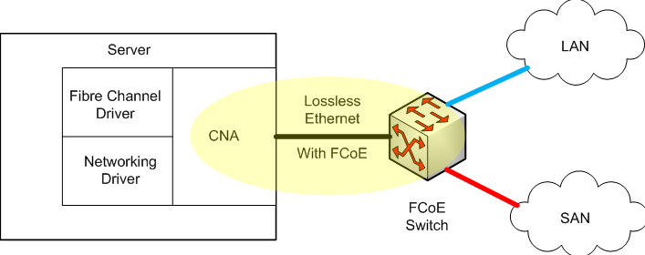

Fibre Channel over Ethernet är en teknik för att enkapsulera Fibre
Channel frames över lossless Ethernet. FCoE fungerar som vanlig FC men
FC0 och FC1 görs av ethernet istället. Se även [Cisco
FC](/Cisco_FC "wikilink"). Genom att konsolidera nätverk och storage
behövs inte lika mycket kablage i datacentret. Servrar som ska nyttja
FCoE behöver converged network adapters dvs de har fysiska
ethernet-portar men de innehåller funktionsmässigt både HBA och NIC.
FCoE har en dedikerad Ethertype, 0x8906, och fungerar med 802.1Q taggar.
Fibre Channel är ett stängt point-to-point medium medans Ethernet är
öppet multi-access medium. Trots detta kan ethernet (med hjälp av vissa
enhancements) användas för att bära FC. Fibre Channel traffic kräver
lossless transport. FCoE har en egen EtherType (0x8906).

**Termer**
\* End Node (E-Node): de noder som har CNA.

-   FCF: Fibre Channel Forwarder är en switch som förstår både FC och
    FCoE.

**Overview**
