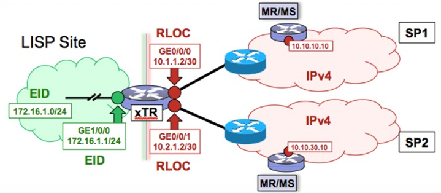

Locator/Identifier Separation Protocol (RFC 6830) är en routing och
adresseringsarkitektur utvecklat av Cisco men är en öppen standard.
Vanligtvis används en IP-adress för att representera både identitet och
lokation men med LISP separeras dessa som RLOC och EID (som går att mixa
mellan IPv4 och IPv6). Att separera identitet och lokation är möjligt
eftersom LISP tunnlar trafik med UDP, dvs det är overlay. Med hjälp av
en registreringsprocess skapas det en mapping database på en ciscorouter
som agerar Map Server och Map Resolver. Denna databas håller alla EID
\<-\> RLOC mappings och det är den man frågar för att få veta var
trafiken för olika IP-adresser ska tunnlas. LISP control plane använder
udp 4342 och data plane trafik skickas till udp 4341.

### Terminology

-   Routing Locator (RLOC)
-   Endpoint ID (EID)
-   Egress Tunnel Router (ETR)
-   Ingress Tunnel Router (ITR)
-   Egress/Ingress Tunnel Router (xTR)
-   Proxy Ingress Tunnel Router (P-ITR)

