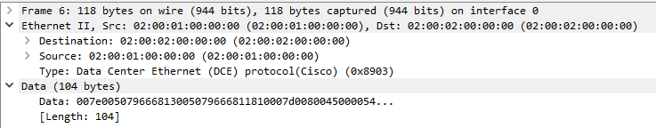

FabricPath är en Ethernet fabric-teknologi framtagen av Cisco för
Nexus-plattformen. Det är designat för att ge hög skalbarhet och
flexibilitet inom ett datacenter genom att kombinera funktioner från
både lager 2 och lager 3. Det är MAC-in-MAC overlay som ersätter
[Spanning-tree protocol](/Cisco_STP "wikilink") med fördelen att inte
behöva några blockerade länkar i ett switchat core (L2MP).
FabricPath-enheterna nyttjar protokollet Intermediate System to
Intermediate System ([IS-IS](/Cisco_IS-IS "wikilink")) för att utbyta
information om hur miljön ser ut (vilka switch ID som finns var) och
bygger ett SPT (Shortest Path Tree) baserat på den informationen. Ingen
STP körs inom FabricPath-nätverket men alla FabricPath Layer 2 gateway
devices ska ha samma låga prio för att FP ska vara STP-root och utifrån
sett är alla FP-enheter en enda stor STP-switch.

För data plane så enkapsuleras ethernet frames med en FabricPath-header
med outside source address och outside destination address vilket sedan
kan routas. FP använder conversational learning och BUM skickas i ett
MDT som automatiskt byggs av alla enheter, så alla får denna trafik och
det är loopfritt. För att veta hur multidestinationstrafik ska
forwarderas används FTAG-fältet i FP-headern. Eftersom det används
multipla FTAG:s som hashas emellan ger detta lastdelning. För att synka
FTAG:ar används en extension till FabricPath IS-IS som heter DRAP
(Dynamic Resource Allocation Protocol). DRAP används också för att
assigna unika switch ID:n inom FP-domänen men detta går även att konfa
manuellt.

När man ska spegla portar ([SPAN](/Cisco_SPAN "wikilink")) kan man välja
om man ska strippa fabricpath-headern eller inte.
[BFD](/Cisco_BFD "wikilink") kan man använda om man kör fabricpath som
DCI-lösning för att snabba upp konvergens. När man kör vPC i kombination
med FabricPath skapas en logisk switch genom att samma FP switch-id
annonseras ut från båda noderna i vPC-domänen, detta kallas vPC+. Se
även [Nexus vPC](/Nexus_vPC "wikilink").

Wireshark kan inte avkoda FabricPath-frames.
